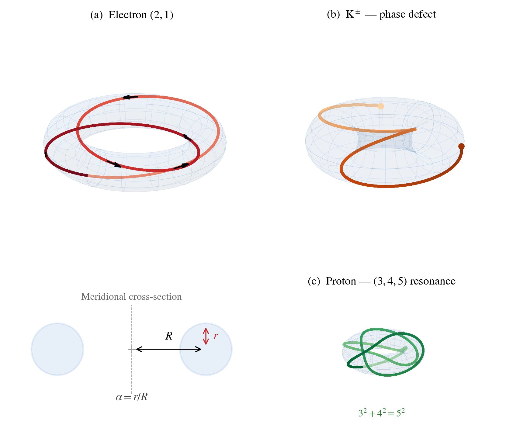

# What is the Null Worldtube?

Imagine a photon — a particle of light — trapped on the surface of a donut, racing around it in a knotted path that closes on itself after winding twice around the long way and once around the short way. That knotted loop of light *is* the electron.

This is the central idea of the **Null Worldtube Theory (NWT)**. The electron is not a point particle with dozens of unexplained properties. It is a specific geometric object — a **(2,1) torus knot** — and nearly everything we measure about it follows from the shape of the donut it lives on.

## One Mass + Three Integers = 23 Predictions

The entire Standard Model of particle physics has 26 free parameters — numbers like particle masses, mixing angles, and coupling constants that physicists have measured but never explained. NWT derives **23 of them** from just four inputs:

- **One measured mass:** the electron mass (0.511 MeV)
- **Three integers:** **(p, q, k) = (2, 1, 3)**

These three integers describe the geometry:
- **p = 2** — the photon winds twice around the donut (toroidal winding)
- **q = 1** — it winds once around the tube (poloidal winding)
- **k = 3** — the donut is three times wider than its tube (aspect ratio)

From these alone, the theory predicts the masses of all quarks and leptons, the Higgs boson mass, the Weinberg angle, the strong coupling constant, neutrino mixing angles, and more — with a **median error of 0.7%** against experimental measurements.

## A Forgotten Discovery, Rediscovered

In the 1980s, a computer scientist named **F. Ray Skilton** at Brock University published three papers proving that the fine-structure constant — one of the most fundamental numbers in physics — could be derived from a Pythagorean triple:

> 882 + 1052 = 1372

giving **1/&alpha; = &radic;(1372 + &pi;2) = 137.036016**, which matches the measured value to **0.12 parts per million**.

These papers were published in minor conference proceedings, received zero citations, and were never digitized. Physical copies were located in the stacks of the University of Washington Engineering Library in February 2026, in volumes with crumbling bindings. ([Scanned pages are available in the GitHub repo.](https://github.com/JimGalasyn/null-worldtube/tree/main/papers/Skilton))

NWT reveals *why* Skilton's formula works: the numbers 88 and 105 are generated by the torus quantum numbers (p, q, k) = (2, 1, 3). The forgotten Pythagorean triple is the geometric signature of the electron.

**References:**
- Skilton, F.R. "Foundation for an integer-based cosmological model." *Proc. 17th Annual Pittsburgh Conf. on Modeling and Simulation*, Vol. 17, Part 1 (1986), pp. 295-300.
- Skilton, F.R. "Foundation for an integer-based cosmological model — Part 2: Evenness." *Proc. 18th Annual Pittsburgh Conf.*, Vol. 18, Part 5 (1987), pp. 1623-1630.
- Skilton, F.R. "Foundation for an integer-based cosmological model — Part 3: Integers and the Natural Constants." *Proc. 19th Annual Pittsburgh Conf.*, Vol. 19, Part 1 (1988), pp. 9-12.

---

[The Predictions](results.html) &#183; [Papers](papers.html) &#183; [About](about.html)
