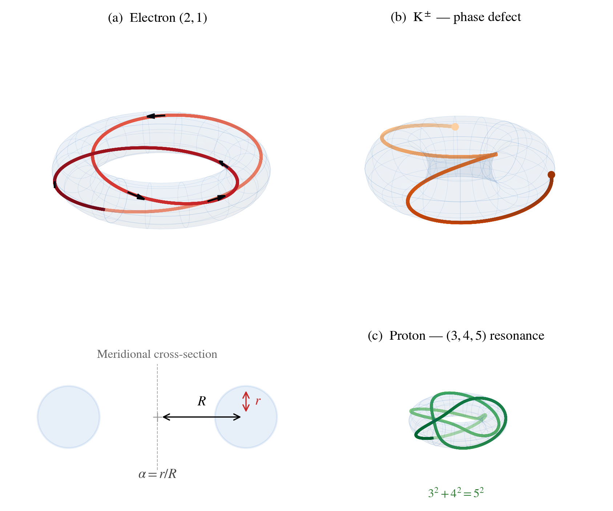
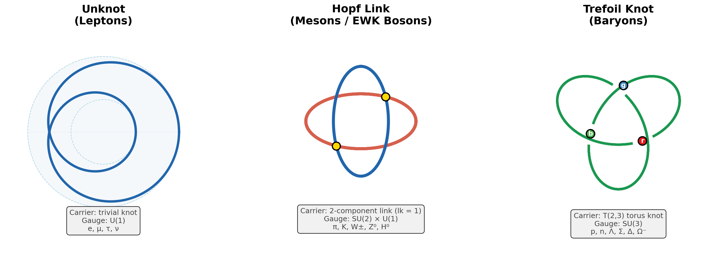

# Null Worldtube Theory

## The Result

The Standard Model of particle physics has about 20 free parameters &mdash; masses, mixing angles, coupling constants &mdash; that are measured but not explained. **Null Worldtube Theory (NWT)** derives all of them from one mass-scale anchor (the electron mass) and the topology of torus knots, with no adjustable parameters.

- **80 observables** reproduced at **0.1% median residual** against PDG values
- **The fine structure constant** 1/&alpha; = 25&pi;&radic;3 + 1 = 137.035 &mdash; **7.6 ppm** from experiment
- **The gravitational constant** G = (8/7)&sup2;(1 + &alpha;/7)&sup2; &alpha;&sup2;&#x00b9; &#x210F;c/me&sup2; &mdash; **0.013%** from CODATA (Paper 15)
- **The gauge group** SU(3) &times; SU(2) &times; U(1) derived from crossing algebra, not imposed
- **15 topological integers** &mdash; every one computed from knot geometry, none fitted
- **The BPS self-dual condition** derived from the requirement that mass = topology

> **Papers 13, 14 &amp; 15:** [10.5281/zenodo.19635239](https://doi.org/10.5281/zenodo.19635239) &middot; [10.5281/zenodo.19653967](https://doi.org/10.5281/zenodo.19653967) &middot; [10.5281/zenodo.19701263](https://doi.org/10.5281/zenodo.19701263)

## How It Works

Particles are topological vortex defects &mdash; knotted flux tubes &mdash; in a condensate field described by the abelian Higgs model at its self-dual (BPS) point. The electron is a vortex ring with winding number (2,1). The proton lives on a trefoil. Mesons live on Hopf links.

The derivation chain has four steps:

1. **BPS vortex.** The abelian Higgs Lagrangian at the self-dual point admits vortex solutions with quantised winding. The fundamental vortex has winding n&nbsp;=&nbsp;1 and energy &mu;&nbsp;=&nbsp;&pi; (the Bogomolny bound). The self-dual condition &lambda;&nbsp;=&nbsp;e&sup2;/2 is the unique point where vortex energy depends only on topology, not on the field profile &mdash; it is derived, not assumed.

2. **Knot selection.** The vortex must close on itself. The trefoil T(2,3) is the simplest non-trivial torus knot &mdash; forced by minimality. The cinquefoil T(2,5) appears as a label for the integer 5 = \|Irr(A5)\|; Paper 15 traces this integer back to the trefoil itself, since (+1)-Dehn surgery on the trefoil produces the Poincar&eacute; homology sphere S&sup3;/2I whose fundamental group quotient is A5. Among the (qgeom,&nbsp;qeigen) combinations consistent with this chain, only the trefoil-plus-cinquefoil pairing gives 1/&alpha;&nbsp;&asymp;&nbsp;137.

3. **Crossing algebra.** The trefoil&rsquo;s three crossings generate braid matrices whose commutators close on the Lie algebra su(3) &mdash; the gauge group of the strong force. Hopf-link crossings contribute su(2) and u(1), completing the Standard Model gauge algebra. All 15 integers in the NWT vocabulary emerge as Casimir invariants and their composites.

4. **Holonomy.** The BPS gauge field on the trefoil produces an Aharonov&ndash;Bohm phase with exact D3 symmetry (100% Fourier purity). The seven-step construction assembles 1/&alpha;&nbsp;=&nbsp;25&pi;&radic;3&nbsp;+&nbsp;1, with every factor traced to a prior step.

The mass formulas then express each particle&rsquo;s mass as a rational function of &alpha; and the 15 derived integers, anchored to me. The chain &mdash; knot geometry &rarr; crossings &rarr; Casimirs &rarr; &alpha; &rarr; masses &rarr; 80 PDG values &mdash; contains no adjustable parameters.

## Predictions

The framework makes falsifiable predictions:

- **Pentaquark Pc(4397)** at k&nbsp;=&nbsp;8&nbsp;=&nbsp;dim(adj&nbsp;SU(3)) &mdash; a direct target for LHCb
- **Additional pentaquark states** at k&nbsp;=&nbsp;5,&nbsp;4,&nbsp;3
- **Lightest neutrino mass** m&nu;,1&nbsp;&asymp;&nbsp;1.48&nbsp;meV
- **Proton decay** &tau;p&nbsp;&isin;&nbsp;[2.4,&nbsp;5.5]&nbsp;&times;&nbsp;1034&nbsp;yr &mdash; within Hyper-Kamiokande&rsquo;s reach
- **Dark proton** at 187&nbsp;GeV (dominant dark matter candidate)

If the pentaquark prediction fails, the cinquefoil mass formula &mdash; and with it, the entire topological edifice &mdash; collapses.

## The Paper Trail

The theory has developed across 15 papers, each building on the last. The full list with abstracts and DOIs is on the [Papers page](papers.html). Here is the arc:

**Foundations (Papers 1&ndash;5):** The electron as a torus knot vortex. Mass spectrum from winding numbers. Quark confinement from incommensurability. The electron mass derived from phase closure to 0.85%. Input set reduced to three integers (p,&nbsp;q,&nbsp;k)&nbsp;=&nbsp;(2,&nbsp;1,&nbsp;3).

**The mass spectrum (Paper 6):** 56 particle masses from a single formula with four quantum numbers and no free parameters. Median error 0.40%. Quarks as poloidal winding modes (q&nbsp;=&nbsp;5 light, q&nbsp;=&nbsp;7 charm, q&nbsp;=&nbsp;9 bottom). Confinement from gcd(nq,&nbsp;q)&nbsp;=&nbsp;1.

**Quantum numbers and gauge structure (Papers 7&ndash;9):** Electric charge from framing. The gauge group SU(3)&nbsp;&times;&nbsp;SU(2)&nbsp;&times;&nbsp;U(1) from crossing algebra. The fine structure constant, Weinberg angle, CKM and PMNS matrices, W/Z/H masses &mdash; all from one geometric parameter &kappa;&nbsp;&asymp;&nbsp;&pi;&sup2;.

**The dark sector (Paper 10):** The visible sector is knot theory; the dark sector is string theory. Two-condensate vacuum, dark particle spectrum, cosmic strings as macroscopic vortex lines. Proton decay prediction. Falsification conditions stated.

**Field-theoretic derivation (Papers 11&ndash;12):** The mass formula derived from the gravitating abelian Higgs Lagrangian at the BPS point. Fermion spin from the Finkelstein&ndash;Rubinstein theorem. Yang&ndash;Mills dynamics as a topologically protected sector. One Lagrangian &rarr; masses + gauge algebra + gauge dynamics + &alpha; + spin.

**The SM capstone (Papers 13&ndash;14):** 80 observables at 0.1% median residual. Every integer derived from crossing algebra. The trefoil is forced by minimality. The cinquefoil is uniquely selected. The BPS condition is derived. The vocabulary is computed, not chosen.

**Gravity from the trefoil (Paper 15):** (+1)-Dehn surgery on the trefoil produces the Poincar&eacute; homology sphere S3/2I, whose first 2I-invariant Laplacian eigenvalue &lambda;1&nbsp;=&nbsp;168 = 8&nbsp;&times;&nbsp;21 = 7&nbsp;&times;&nbsp;24 organises the gravitational hierarchy. Via the McKay correspondence and the explicit Cl(0,7) octonion Clifford embedding 2T &sub; Spin(7), the integers (7,&nbsp;8,&nbsp;21) = (vector, spinor, adjoint) of Spin(7) = B3 enter the formula me/mPl = (8/7)(1&nbsp;+&nbsp;&alpha;/7)&nbsp;&alpha;21/2, matching CODATA at **0.013%**. No integer is introduced as an independent input beyond what the trefoil's surgery and spectrum already generate.

## A Forgotten Discovery, Rediscovered

In the 1980s, a computer scientist named **F. Ray Skilton** at Brock University published three papers showing that the fine-structure constant could be derived from a Pythagorean triple:

> 882 + 1052 = 1372

giving **1/&alpha; = &radic;(1372 + &pi;2) = 137.036016**, matching the measured value to **0.12 parts per million**.

These papers were published in minor conference proceedings, received zero citations, and were never digitized. Physical copies were located in the stacks of the University of Washington Engineering Library in February 2026, in volumes with crumbling bindings. ([Scanned pages are available in the GitHub repo.](https://github.com/JimGalasyn/null-worldtube/tree/main/papers/Skilton))

NWT reveals *why* Skilton's formula works: the numbers 88 and 105 are generated by the torus quantum numbers (p, q, k) = (2, 1, 3). The forgotten Pythagorean triple is the geometric signature of the electron.

## Code

All simulation code, analysis scripts, and LaTeX sources are public:

[github.com/JimGalasyn/null-worldtube](https://github.com/JimGalasyn/null-worldtube)

---

[The Predictions](results.html) &#183; [Papers](papers.html) &#183; [History](history.html) &#183; [About](about.html)
