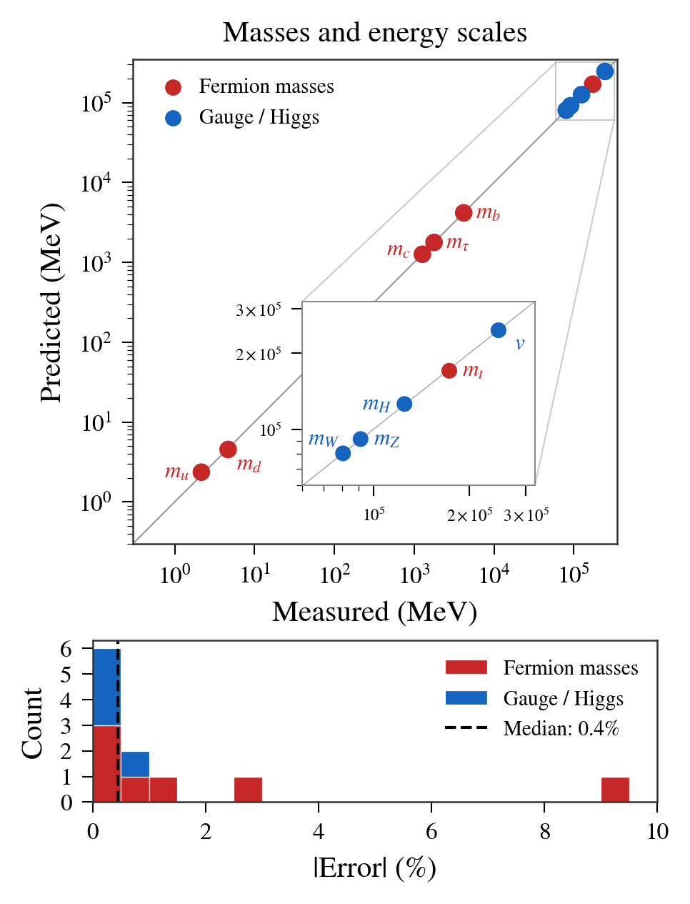
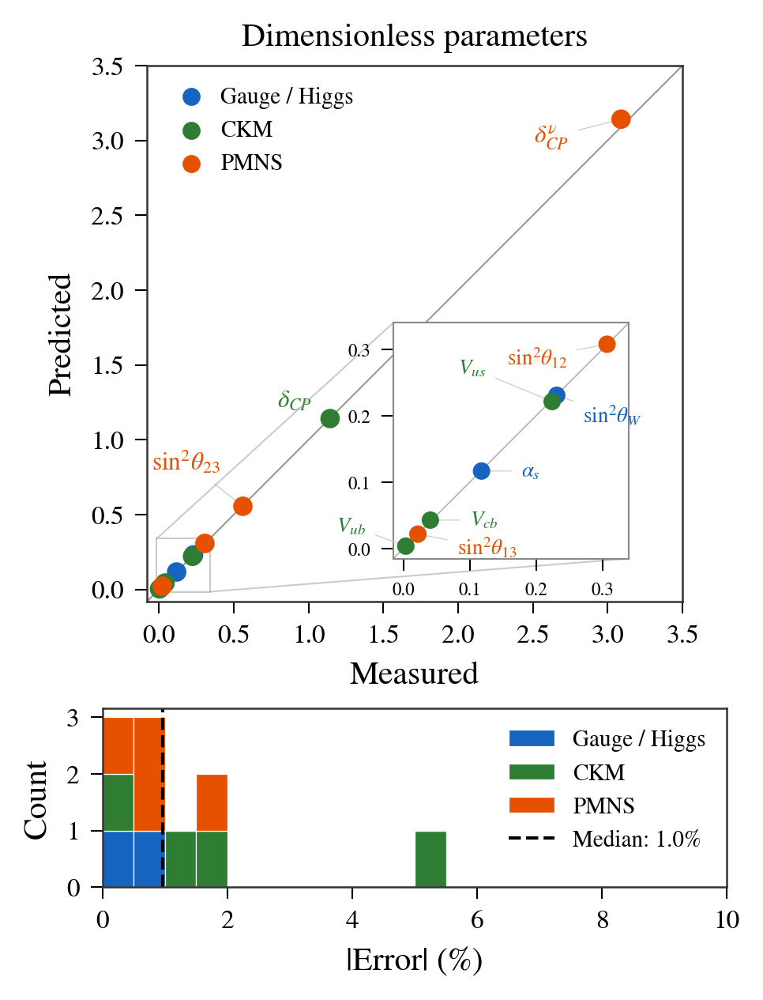
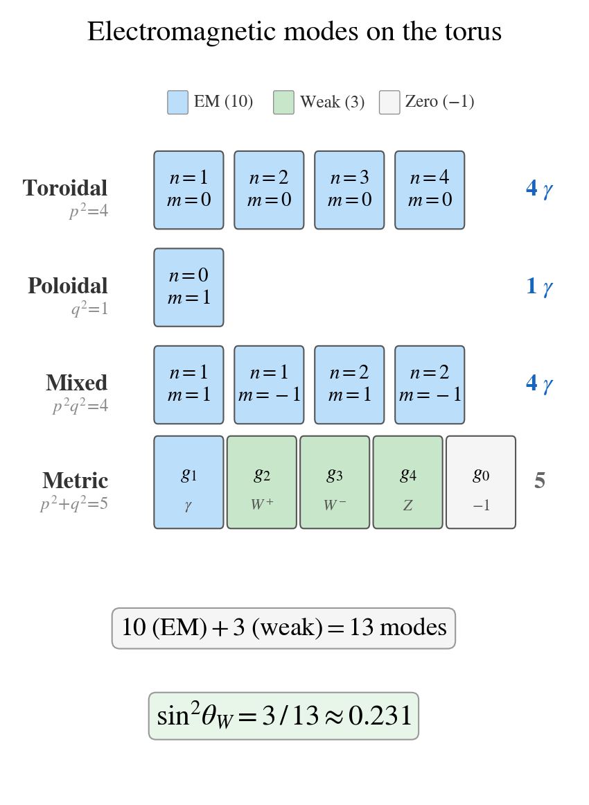
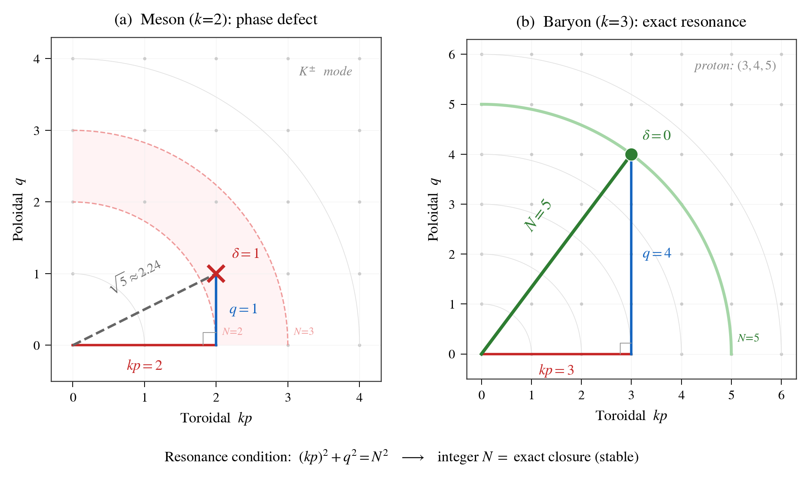

# The Predictions

NWT derives 23 Standard Model parameters from one measured mass and three integers. Here's how the predictions compare to experiment.

## Predicted vs. Measured Masses

Eleven mass and energy predictions plotted against their measured values. Perfect agreement falls on the diagonal line. The inset zooms in on the electroweak cluster (W, Z, Higgs, and the tube energy scale). The histogram at the bottom shows the distribution of errors — most predictions land within 1% of the measured value.

**Median error for masses: 0.4%**

## Dimensionless Parameters

Ten dimensionless predictions — mixing angles, CP-violating phases, and coupling constants — compared to their measured values. These are pure numbers with no units, making them especially stringent tests.

**Median error for dimensionless parameters: 1.0%**

## Highlight Predictions

| Parameter | Predicted | Measured | Error |
|:----------|:----------|:---------|:------|
| Tau mass | 1776.9 MeV | 1776.86 MeV | 0.001% |
| Muon mass | 105.658 MeV | 105.658 MeV | 0.001% |
| Higgs mass | 125.97 GeV | 125.10 GeV | 0.7% |
| Higgs VEV | 246.34 GeV | 246.22 GeV | 0.049% |
| Top quark mass | 170.4 GeV | 172.76 GeV | 1.3% |
| Bottom quark mass | 4172 MeV | 4180 MeV | 0.2% |
| Weinberg angle (sin2&theta;W) | 3/13 = 0.23077 | 0.23122 | 0.19% |
| Strong coupling (&alpha;s) | 16&alpha; = 0.11676 | 0.1179 | 0.97% |
| CKM CP phase | &pi; &minus; 2 = 1.1416 rad | 1.144 rad | 0.2% |
| Solar neutrino angle | 4/13 = 0.3077 | 0.307 | 0.2% |
| Fine-structure constant (1/&alpha;) | 137.036016 | 137.035999 | 0.12 ppm |
| Proton-to-electron mass ratio | 6&pi;5 = 1836.118 | 1836.153 | 0.002% |
| Neutrino mass sum (&Sigma;m&nu;) | 59 meV | < 64 meV | consistent |

**Overall median error: 0.7%. RMS: 2.6%. Maximum: 9.3% (up quark mass, within PDG uncertainty).**

## Why Is the Weinberg Angle 3/13?

Count the ways a field can oscillate on a torus: 4 toroidal modes, 1 poloidal, 4 mixed, and 4 knot-metric modes, minus 1 zero mode = **13 total**. Of these, exactly **3 couple to the weak force** (the W+, W&minus;, and Z bosons).

The Weinberg angle — which controls how the electromagnetic and weak forces mix — is simply the fraction of modes that are weak:

> sin2&theta;W = 3/13 = 0.2308

The measured value is 0.2312. That's a 0.19% error from *counting modes on a donut*.

The same denominator appears in the solar neutrino mixing angle: sin2&theta;12 = 4/13 = 0.3077.

## Why Protons Are Stable and Mesons Aren't

When you unwrap a torus into a flat rectangle, standing waves must satisfy a resonance condition. For particles with aspect ratio k, this becomes:

> (kp)2 + q2 = N2

This is just asking: do the quantum numbers form a **Pythagorean triple**?

- **Mesons (k=2):** No integer solution exists for p=1. Every meson has a *phase defect* and eventually decays. The K&plusmn; meson has the smallest possible defect (&delta;=1), which is why it lives longest among strange mesons.

- **Baryons (k=3):** The proton sits exactly on **32 + 42 = 52**, the most famous Pythagorean triple. Zero phase defect. Perfect resonance. The proton is stable because its quantum numbers form a *closed standing wave* — it's the geometric equivalent of a perfectly tuned guitar string.

The stability of matter is a consequence of Pythagorean geometry.

## Nuclear Magic Numbers (Paper 3)

The same torus geometry that predicts particle masses also explains nuclear structure — spanning twelve orders of magnitude in energy.

### The Derivation Chain

Starting from the pion mass m&pi; = 2me/&alpha; = 140.1 MeV (0.34% accuracy):

| Step | Formula | Value | Measured |
|:-----|:--------|:------|:---------|
| Pion mass | 2me/&alpha; | 140.1 MeV | 139.6 MeV (0.34%) |
| Pion decay constant | (k+1)/k &times; me/&alpha; | 93.4 MeV | 92.1 MeV (1.4%) |
| Nuclear potential | Ceff &times; one-pion exchange | 50.2 MeV | ~50 MeV (textbook) |
| Scalar potential S | &minus;k2V0 | &minus;452 MeV | ~&minus;450 MeV |
| Vector potential V | (k2&minus;1)V0 | +401 MeV | ~+400 MeV |
| Spin-orbit V&minus;S | (2k2&minus;1)V0 | 853 MeV | ~850 MeV |

The spin-orbit strength is the "holy grail" of nuclear physics — it determines which nuclei are magic. Most models fit this number to data; NWT derives it from k=3.

### All Seven Magic Numbers

Without spin-orbit coupling, a shell model gives: 2, 8, 20, 40, 58, 92, ...

With the NWT-derived spin-orbit (V&ell;s = 35 MeV&middot;fm2):

> **2, 8, 20, 28, 50, 82, 126** &checkmark;

Every magic number is correct. The model also predicts **N = 184** as the next magic number, testable in superheavy element experiments.

### Decay Chain Validation

The four natural radioactive decay series, traced using NWT-derived nuclear masses with shell corrections, terminate at the correct stable endpoints:

| Series | Start | Endpoint (predicted) | Endpoint (actual) |
|:-------|:------|:---------------------|:-------------------|
| Thorium | 232Th | 208Pb | 208Pb &checkmark; |
| Neptunium | 237Np | 209Bi | 209Bi &checkmark; |
| Uranium | 238U | 206Pb | 206Pb &checkmark; |
| Actinium | 235U | 207Pb | 207Pb &checkmark; |

The doubly-magic 208Pb — terminus of three of the four series — owes its exceptional stability to shell closures at Z=82 and N=126, which are direct consequences of k=3.

## Dynamical Derivations (Paper 4)

Paper 4 derives the torus geometry dynamically rather than assuming it:

| Quantity | Formula | Value | Measured | Error |
|:---------|:--------|:------|:---------|:------|
| Tube radius | r/R = 1/&pi;&sup2; | 0.1013 | 0.10392 | 2.5% |
| Pion mass | 2me/&alpha; | 140.05 MeV | 139.57 MeV | 0.34% |
| Top quark mass | 2k&sup2;me/&alpha;&sup2; | 172,730 MeV | 172,760 MeV | 0.02% |

Quark confinement is explained by incommensurability: when gcd(nquarks, qpoloidal) = 1, the mode is localized and cannot propagate alone.

## The Electron Mass (Paper 5)

Paper 5 eliminates the electron mass as a free parameter:

| Condition | Result |
|:----------|:-------|
| Phase closure on (2,1) knot at m=3 | R/&xi; = &radic;5/2 = 1.1180 (Pythagorean: 3&sup2; = (&radic;5)&sup2; + 2&sup2;) |
| Dual resonance with (1,4) proton | &kappa; = 12/&radic;7 = 4.536 |
| Vortex ring energy balance | me = 9.19 &times; 10&minus;31 kg (0.85% match) |

The input set is now reduced to **three integers**: (p, q, k) = (2, 1, 3). The electron mass, previously the sole dimensional input, is derived from the topology of the torus knot in a superfluid vacuum.

---

[Home](index.html) &#183; [Papers](papers.html) &#183; [About](about.html)
